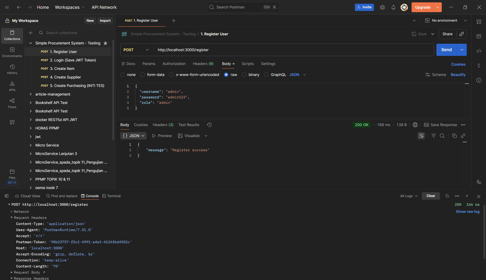
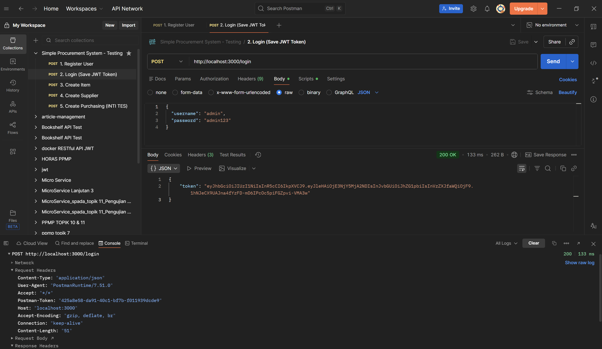
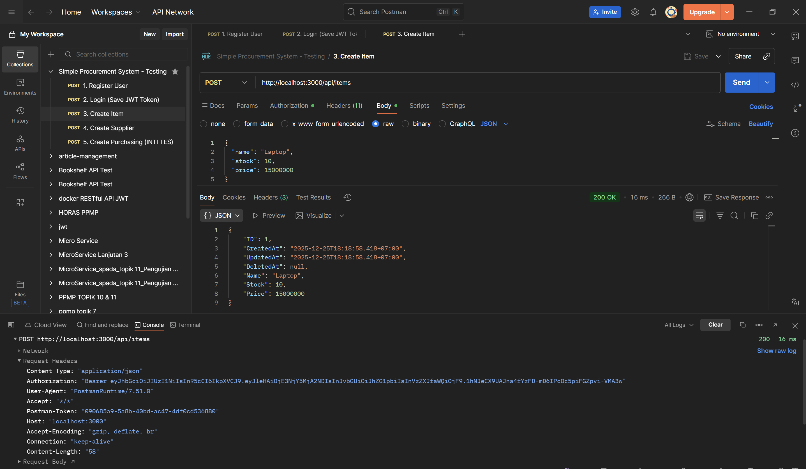
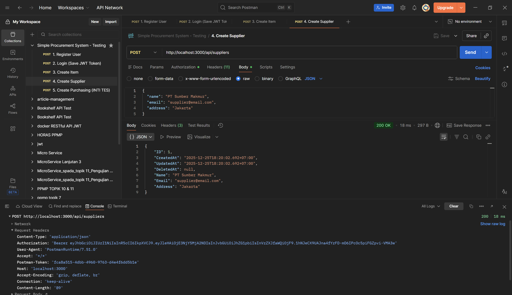
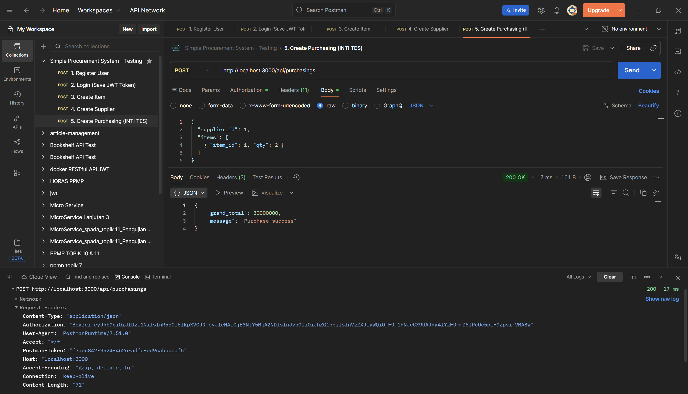
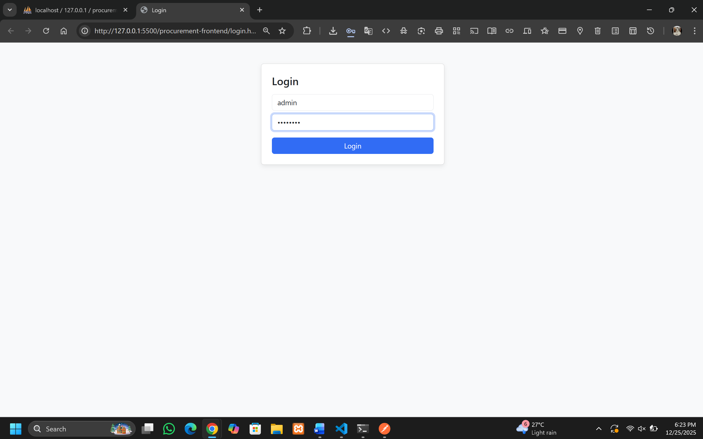
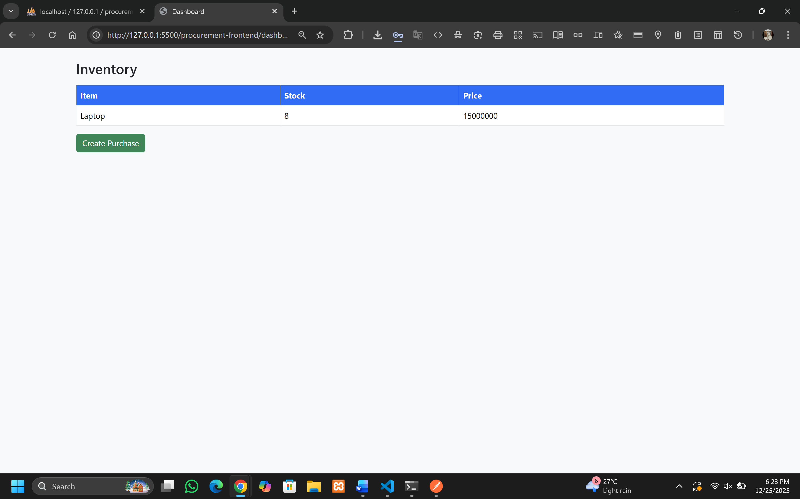
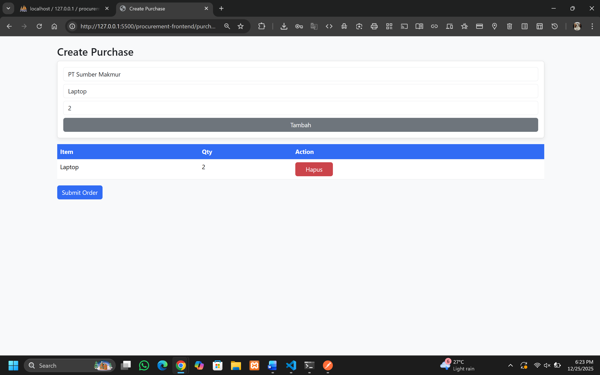

# 🚀 Procurement System (Sistem Pengadaan Barang)
Aplikasi web sederhana untuk mencatat pembelian barang (Procurement) dari Supplier. Terdiri dari Backend (Go + Fiber + MySQL) dan Frontend (HTML + jQuery + Bootstrap).

[](https://golang.org/)
[](https://gofiber.io/) 
[](https://www.mysql.com/) 
[](https://getbootstrap.com/) 
[](https://jquery.com/) 
[](https://jwt.io/)

## 📌Fitur Utama
Backend
| Fitur | Keterangan |
|-------|-----------|
| User Authentication | Register & Login (JWT Token) |
| Master Data | CRUD Items & CRUD Suppliers |
| Purchasing Transaction | Buat pembelian baru, hitung subtotal & grand total, update stok otomatis |
| Bonus | Transaction ACID (rollback jika gagal), Webhook async notifikasi |

Frontend
- Login Page
- Dashboard & Inventory
- Create Purchase Page (keranjang + submit order)
- Reusable AJAX & Event Delegation
- SweetAlert2 untuk notifikasi/error handling

## 🛠 Tech Stack

### Backend
- **Language**: Go (Golang)
- **Framework**: Fiber
- **ORM**: GORM
- **Database**: MySQL (XAMPP / lokal compatible)
- **Authentication**: JWT (JSON Web Token)
- **Security**: Password hashing (bcrypt)
- **Transaction**: ACID Transaction support (rollback jika gagal)
- **HTTP Client / Webhook**: net/http (async POST notification)
- **Environment**: dotenv (`.env` file)
- **Dependency Management**: Go Modules (`go.mod` / `go.sum`)

### Frontend
- **Markup / Styling**: HTML, CSS, Bootstrap 5
- **Behavior / Interactivity**: JavaScript, jQuery
- **AJAX Requests**: jQuery AJAX wrapper (`api.js`)
- **Authentication Handling**: JWT token di `localStorage`
- **Notifications / Alerts**: SweetAlert2
- **Structure**: Dashboard, Create Purchase page, reusable components
- **Dev Tools**: Browser Live Server / VS Code
- **CDN Usage**: Bootstrap, jQuery, SweetAlert2


## 📂 PROCUREMENT-SYSTEM
- 📁 config
  - 📄 database.go — Koneksi DB & migrasi otomatis
- 📁 handlers
  - 📄 auth_handler.go — Register & Login user, JWT token
  - 📄 item_handler.go — CRUD Item
  - 📄 purchasing_handler.go — Proses transaksi pembelian
  - 📄 supplier_handler.go — CRUD Supplier
- 📁 middleware
  - 📄 jwt_middleware.go — Proteksi endpoint dengan JWT
- 📁 models
  - 📄 item.go — Struktur Item
  - 📄 purchasing_detail.go — Detail transaksi
  - 📄 purchasing.go — Header transaksi
  - 📄 supplier.go — Struktur Supplier
  - 📄 user.go — Struktur User
- 📁 routes
  - 📄 routes.go — Definisi route API & middleware
- 📁 utils
  - 📄 jwt.go — Fungsi generate JWT
- 📁 procurement-frontend
  - 📁 css
    - 📄 style.css — Styling halaman
  - 📁 js
    - 📄 api.js — Wrapper AJAX + token handling
    - 📄 auth.js — Login page JS
    - 📄 dashboard.js — Dashboard page JS
    - 📄 purchase.js — Halaman create purchase
  - 📄 dashboard.html — Tabel inventory & link create purchase
  - 📄 login.html — Halaman login
  - 📄 purchase.html — Halaman create purchase
- 📄 .env — Konfigurasi environment (DB, JWT secret)
- 📄 go.mod — Modul Go
- 📄 go.sum — Modul Go
- 📄 main.go — Entry point aplikasi
- 📄 Local_Procurement_Env.postman_environment.json
- 📄 Simple_Procurement_System.postman_collection.json

## ⚙️ Persiapan Backend
  1. Pastikan sudah menginstall:
     - Go >= 1.20
     - MySQL / PostgreSQL
     - Git
  2. Clone repository backend:
     ```bash
     git clone https://github.com/rishia16/procurement-system.git
  3. masuk ke directory procurement-system:
     ```bash
     cd procurement-system
  4. Install dependencies Go:
     ```bash
     go mod tidy
  5. Buat database MySQL:
     ```bash
     CREATE DATABASE procurement;
  6. Buat /sesuaikan file .env di folder backend:
     ```bash
     DB_USER=root
     DB_PASS=
     DB_HOST=localhost
     DB_PORT=3306
     DB_NAME=procurement
     JWT_SECRET=super_rahasia
     #- Sesuaikan DB_USER, DB_PASS, dll. dengan setup MySQL masing-masing -#
  7. Jalankan backend:
     ```bash
     go run main.go
     #- Server akan berjalan di http://localhost:3000 -#
     
## ⚙️ Persiapan Frontend
  1. didalam directory procurement arahkan masuk menggunakan Visual Studio Code kedalam directory procurement-frontend
  2. Tidak perlu install apapun (semua library via CDN).
  3. Buka login.html di VS Code menggunakan Live Server / browser untuk memulai.

## 📝 Cara Menggunakan Aplikasi Frontend
- Register & Login
  - Akses login.html
  - Masukkan username & password
  - Klik Login → token disimpan otomatis di localStorage
- Dashboard
  - Tampilkan daftar items & stok
  - Link ke halaman Create Purchase
- Create Purchase
  - Pilih Supplier
  - Pilih Item & input Qty, klik Tambah
  - Item masuk ke keranjang tabel
  - Klik Submit Order → backend otomatis hitung subtotal & grand total, update stok
  - Notifikasi sukses/error muncul via SweetAlert2

## 🛠️ Endpoint API Backend
| Method | Endpoint         | Keterangan                   | Protected |
| ------ | ---------------- | ---------------------------- | --------- |
| POST   | /register        | Register user                | ❌         |
| POST   | /login           | Login user, return JWT token | ❌         |
| GET    | /api/items       | List items                   | ✅         |
| POST   | /api/items       | Tambah item                  | ✅         |
| GET    | /api/suppliers   | List suppliers               | ✅         |
| POST   | /api/suppliers   | Tambah supplier              | ✅         |
| POST   | /api/purchasings | Buat purchase baru           | ✅         |

> Catatan: Semua endpoint `/api/...` protected → membutuhkan token JWT.

## 📊 Rubrik Penilaian
  Backend
  - Setup, Auth, Schema, Logic, Security
  - Bonus: DB Transaction, Webhook
  
  Frontend
  - Tech (jQuery & CDN)
  - Auth (Login + Token)
  - Fetch Data, DOM Manipulation, Submit JSON
  - Bonus: Event Delegation, Reusable AJAX

## 📝 Catatan Teknis Tambahan
  > - Cara reset database: hapus tabel & buat ulang sesuai schema
  > - Test API menggunakan Postman (import Simple_Procurement_System.postman_collection.json)
  > - Port default backend: http://localhost:3000 (atau menggunakan import environtment Local_Procurement_Env.postman_environment.json)

# 📸 Screenshots / Demo

## 🖥️ Backend Screenshots

### 1. Register User
  
*Keterangan:* Halaman/register endpoint untuk menambahkan user baru. Password di-hash dan disimpan di database. JWT belum di-generate di tahap register.

### 2. Login & Save JWT
  
*Keterangan:* Login user valid → server mengembalikan JWT token. Token disimpan di localStorage atau client untuk akses endpoint protected.

### 3. Create Item
  
*Keterangan:* Endpoint `/api/items` untuk menambahkan item baru. JWT dikirim di header Authorization: `Bearer <token>` untuk validasi akses.

### 4. Create Supplier
  
*Keterangan:* Endpoint `/api/suppliers` untuk menambahkan supplier baru. JWT token yang valid wajib dikirim di header.

### 5. Create Purchasing
  
*Keterangan:* Membuat transaksi pembelian. Backend menghitung subtotal & grand total berdasarkan harga di database. Stok item otomatis di-update. Endpoint ini **protected**, membutuhkan JWT token.

---

## 🖥️ Frontend Screenshots

### 1. Login Page
  
*Keterangan:* Form login yang mengirim request ke backend `/login`. JWT token diterima backend disimpan di browser (localStorage) untuk autentikasi endpoint berikutnya.

### 2. Dashboard / Inventory
  
*Keterangan:* Menampilkan daftar item, stok, dan link ke halaman Create Purchase. Frontend mengambil data menggunakan AJAX dengan JWT di header.

### 3. Create Purchase Page
  
*Keterangan:* User memilih supplier, memilih item, input Qty, klik "Tambah" → item masuk ke keranjang. Submit Order mengirim JSON ke backend dengan JWT token. Backend menghitung subtotal & grand total, update stok, dan mengirim notifikasi sukses/error.

---

## 🔐 Studi Kasus JWT

1. **Register:**  
   - Endpoint `/register` membuat user baru. JWT **tidak** dibuat di register.

2. **Login:**  
   - Endpoint `/login` mengembalikan JWT token. Token ini menyimpan `userID`, `username`, `role`, dan expiry.
   - Contoh header JWT saat request ke endpoint protected:  
     ```
     Authorization: Bearer <JWT_TOKEN>
     ```

3. **Endpoint Protected:**  
   - Semua endpoint `/api/items`, `/api/suppliers`, `/api/purchasings` memeriksa JWT di middleware sebelum melakukan aksi.  
   - Jika token tidak valid atau expired → request ditolak (HTTP 401 Unauthorized).

4. **Frontend:**  
   - Setelah login, JWT disimpan di `localStorage`  
   - Setiap AJAX request ke backend menambahkan header `Authorization: Bearer <token>` secara otomatis (menggunakan wrapper `api.js`).
